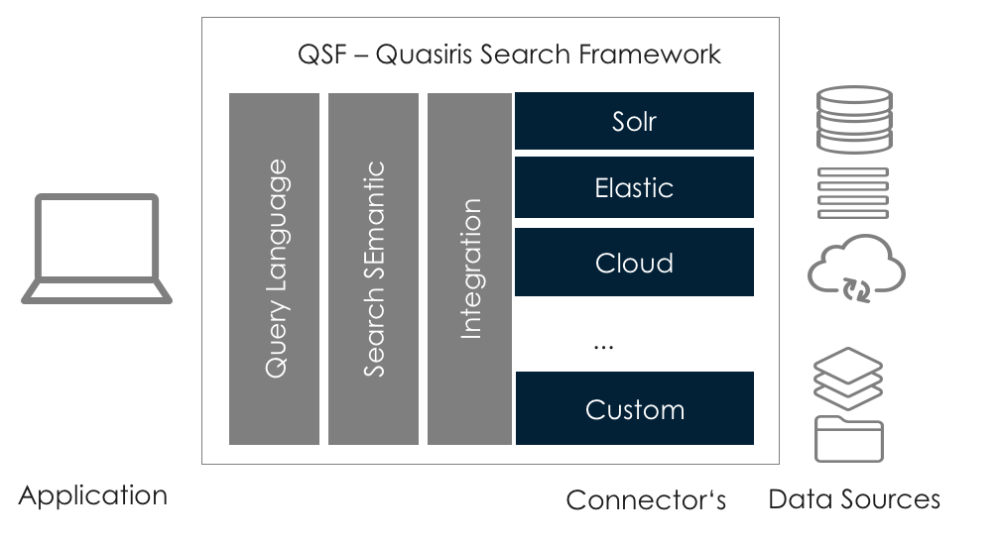

# Quasiris Search Framework (QSF) Integration

The QSF (Quasiris Search Framework) offers a flexible framework to easily create search services and applications.
It coveres the main functionality of typical requirements for search applications in the context of a microservice architectures and reduced the costs and risks.
QSF offers the possibility to use standards and extend the standards with individual requirements.
Therefore in all components exists appropriate mechanisms to integrate and implement custom functionality.

## Typical customer requirements

The requirements that can be solved with the QSF are structured as follows:
- standardisation of the search query language (QSFQL)
- integration of different search engines (e. g. SOLR/Lucene, ElasticSearch, FAST) whithout chaning the interfaces
- support for migration between different search engines or versions of search engines
- base of common requirements for search applications
- high performance (runtime under 5ms)
- parallel processing of search queries
- timeout handling
- docker compatible
- compatible with common frameworks like Spring-Boot, JavaEE
- error handling (e.g. automatic deactivation of erroneous search channels)
- fraud prevention
- easy to use paging, filtering, facetting, sorting, boosting
- decoupling of the search technology from the functional requirements
- full flexibility for the functional design with an easy extensibility in all process steps
- easy intetration with REST
- easy integration of tracking systems

## The Solution
With the QSF you can create stable and high performant search applications in just a few minutes.
It supports the agile development process for desgin, implementation and iterative enhancements of search applications and reduces the costs for the development to a minimum.
Complex configurations are handled in the most cases automatically and errors are avoided.

## License
- [License](LICENSE)